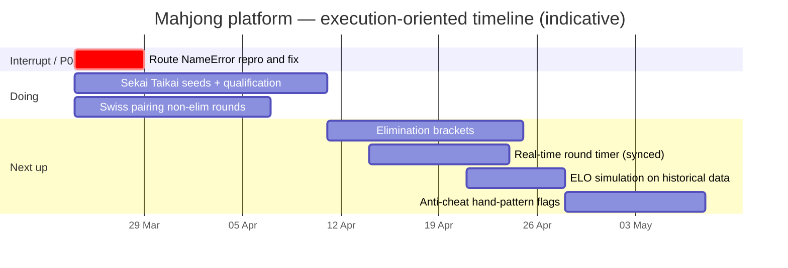

# Mahjong platform roadmap — Gantt (indicative)

```mermaid
gantt
    title Mahjong platform — execution-oriented timeline (indicative)
    dateFormat  YYYY-MM-DD
    axisFormat  %d %b

    section Interrupt / P0
    Route NameError repro and fix     :crit, p0, 2026-03-24, 5d

    section Doing
    Sekai Taikai seeds + qualification :sekai, 2026-03-24, 18d
    Swiss pairing non-elim rounds      :swiss, 2026-03-24, 14d

    section Next up
    Elimination brackets               :elim, after sekai, 14d
    Real-time round timer (synced)     :timer, 2026-04-14, 10d
    ELO simulation on historical data  :elo, 2026-04-21, 7d
    Anti-cheat hand-pattern flags      :ac, 2026-04-28, 10d
```

Backlog items (dark theme audit, mobile polish, PDF, i18n) are not scheduled on this chart.
